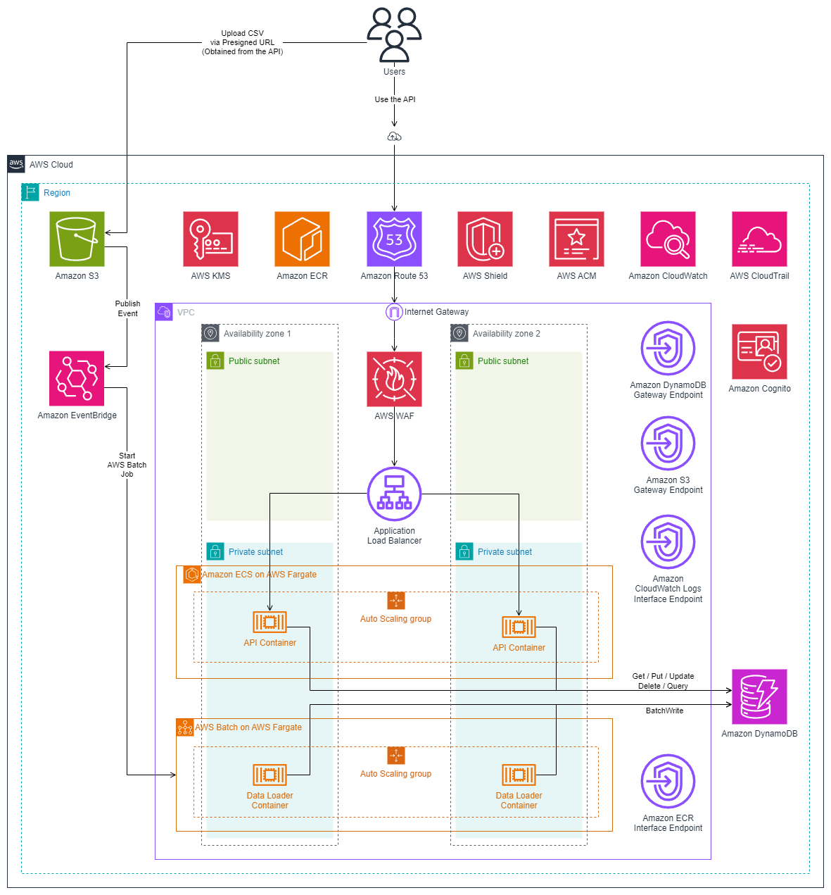

# Order Management

- [Solution](#solution)
  - [Architecture](#architecture)
  - [Design considerations](#design-considerations)
    - [DynamoDB Single-Table Design](#dynamodb-single-table-design)
    - [Amazon ECS on AWS Fargate](#amazon-ecs-on-aws-fargate)
  - [Services](#services)
    - [API Service](#api-service)
    - [Data Loader service](#data-loader-service)
- [Getting started](#getting-started)
  - [Software requirements](#software-requirements)
- [Deploying the solution to AWS cloud](#deploying-the-solution-to-aws-cloud)

---

## Solution

### Architecture



### Design considerations

#### DynamoDB Single-Table Design

The solution is using DynamoDB with the single-table design pattern as the data store. Using this pattern has several benefits including:

- **Reduced latency**: Latency is significantly reduced when employing the single-table design pattern as it directly leads to a reduction in the number of round-trips to DynamoDB.
- **Reduced operational overhead**: "*Even though DynamoDB is fully-managed and pretty hands-off compared to a relational database, you still need to configure alarms, monitor metrics, etc. If you have one table with all items in it rather than eight separate tables, you reduce the number of alarms and metrics to watch.*"
- **Reduced operational cost**: "*With each table you have, you need to provision read and write capacity units. Often you will do some back-of-the-envelope math on the traffic you expect, bump it up by X%, and convert it to RCUs and WCUs. If you have one or two entity types in your single table that are accessed much more frequently than the others, you can hide some of the extra capacity for less-frequently accessed items in the buffer for the other items.*"

More details regarding the single-table design pattern are available at [The What, Why, and When of Single-Table Design with DynamoDB](https://www.alexdebrie.com/posts/dynamodb-single-table/).

#### Amazon ECS on AWS Fargate

`Amazon ECS on AWS Fargate` has been chosen as the compute platform for the solution as it presents several advantages in the context of the requirements:

- **Reduced API latency**: Containers are always running and prepared to process requests. There is no service related latency or overhead.
- **Reduced operational overhead**: There are no instances to manage. The service automatically provisions the required underlying infrastructure to run the containers.
- **Scalability**: ECS automatically scales up and down the number of containers to satisfy the workload being placed on the service.

### Services

The solution consists of two services:

- **API Service**: This service is hosted using `Amazon ECS on AWS Fargate`. Instances of this service are continuously running and handling REST API requests from users.
- **Data Loader Service**: This service is running on demand using `AWS Batch on AWS Fargate`. The exact process is detailed in the next section.

#### API Service

#### Data Loader service

Batch loading orders process:

- The user obtains a presigned Url to an Amazon S3 prefix and uploads a CSV file.
- Once the upload is complete, an event is published to `Amazon EventBridge`.
- `Amazon EventBridge` consumes the message and queues an `AWS Batch Job` for processing the uploaded CSV file.
- The Data Loader container follows a two stage process to process the file:

    1. **Download data**: It first downloads the data locally in ephemeral storage. This is done to reduce access time to the data records and to increase reliability.
    2. **Batch Write to DynamoDB**: A batch write is initiated and the the data records are written to DynamoDB.

## Getting started

### Software requirements

- [Docker Desktop](https://www.docker.com/products/docker-desktop/)
- [AWS CLI](https://aws.amazon.com/cli/)
- [AWS CDK](https://aws.amazon.com/cdk/)
- [DOTNET SDK 8](https://dotnet.microsoft.com/en-us/download/dotnet/8.0)
- [Visual Studio 2022](https://visualstudio.microsoft.com/vs/)
- [NoSQL Workbench for DynamoDB](https://docs.aws.amazon.com/amazondynamodb/latest/developerguide/workbench.html)

## Deploying the solution to AWS cloud

Please follow the below steps to deploy and run the solution in your AWS cloud account:

1. Bootstrap the CDK framework to your AWS account

    ```bash
    cdk bootstrap --termination-protection true
    ```

2. Deploy the CI/CD stack

    ```bash
    cdk deploy JPMC-OrderManagement-CiCdStack
    ```

3. Authenticate to the newly create ECR repository. Make sure to replace the placeholder for `AWS-REGION` and `AWS-ACCOUNT`.

    ```bash
    aws ecr get-login-password --region [AWS-REGION] | docker login --username AWS --password-stdin [AWS-ACCOUNT].dkr.ecr.[AWS-REGION].amazonaws.com
    ```

4. Build the API Docker image

    ```bash
    dotnet publish ./src/JPMC.OrderManagement.API/ --os linux --arch x64 /t:PublishContainer
    ```

5. Tag the new image with the ECR repository URL. Make sure to replace the placeholder for `AWS-REGION` and `AWS-ACCOUNT`.

    ```bash
    docker tag jpmc-order-management-api:latest [AWS-ACCOUNT].dkr.ecr.[AWS-REGION].amazonaws.com/jpmc-order-management-api:latest
    ```

6. Push the image to ECR. Make sure to replace the placeholder for `AWS-REGION` and `AWS-ACCOUNT`.

    ```bash
    docker push [AWS-ACCOUNT].dkr.ecr.[AWS-REGION].amazonaws.com/jpmc-order-management-api:latest
    ```

7. Deploy the networking and the compute stacks.

    ```bash
    cdk deploy --all
    ```


TODO:

- Solution diagram
- Calculate availability
- Consider deployment scenarios (how do you update code, ECS, Redis)
- Consider DR strategy
- CI/CD
- Cost estimate
- Deletion protection where possible
- point-in-time recovery for the data store
- Use a Route 53 domain to host the system
- Consider adding AuthN and AuthZ (https://docs.aws.amazon.com/elasticloadbalancing/latest/application/listener-authenticate-users.html)
- document reasons for using an API Gateway with ECS (per user throttling logic, API keys etc) (https://docs.aws.amazon.com/apigateway/latest/developerguide/http-api-private-integration.html)
- Document what we've done ro reduce latency (ECS - eliminates lambda cold start + lambda service delay, ALB to load balance requests, single table design)
- Enable autoscaling
- Document usage of Single Table Design to reduce cost and latency
- Consider event sourcing
- Use NLB for even lower latencies
- Item lineage via DynamoDB streams in S3

Done:

- Configure CloudWatch Logs logging via configuration keys