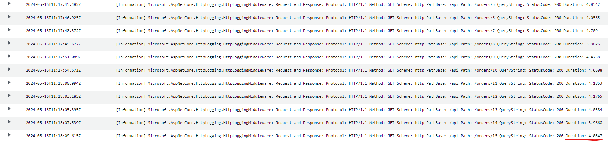
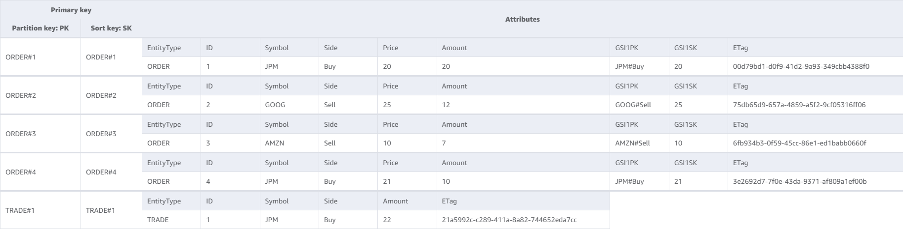
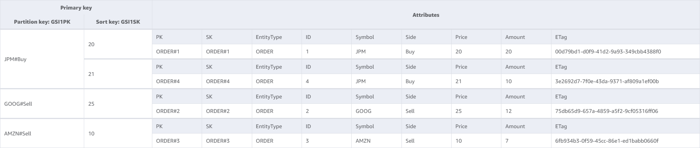

# Order Management

- [Getting started](#getting-started)
  - [Software requirements](#software-requirements)
  - [Running the solution in AWS](#running-the-solution-in-aws)
  - [Batch-loading data](#batch-loading-data)
    - [Sample data](#sample-data)
    - [Additional data](#additional-data)
- [Solution](#solution)
  - [Design considerations](#design-considerations)
    - [DynamoDB Single-Table Design](#dynamodb-single-table-design)
    - [Amazon ECS on AWS Fargate](#amazon-ecs-on-aws-fargate)
    - [Amazon Batch on AWS Fargate](#amazon-batch-on-aws-fargate)
    - [Private Connectivity](#private-connectivity)
  - [Services](#services)
    - [API Service](#api-service)
    - [Data Loader service](#data-loader-service)
  - [DynamoDB data store](#dynamodb-data-store)
    - [Table Design](#table-design)
    - [Table GSI1 Design](#table-gsi1-design)

---

[](https://github.com/smiron/JPMC.OrderManagement/actions/workflows/dotnet.yml) [](https://github.com/smiron/JPMC.OrderManagement/actions/workflows/codeql.yml) [](https://github.com/smiron/JPMC.OrderManagement/actions/workflows/docker-image.yml)


## Getting started

### Software requirements

- [Docker Desktop](https://www.docker.com/products/docker-desktop/)
- [AWS CLI](https://aws.amazon.com/cli/)
- [AWS CDK](https://aws.amazon.com/cdk/)
- [DOTNET SDK 8](https://dotnet.microsoft.com/en-us/download/dotnet/8.0)
- [Visual Studio 2022](https://visualstudio.microsoft.com/vs/)
- [NoSQL Workbench for DynamoDB](https://docs.aws.amazon.com/amazondynamodb/latest/developerguide/workbench.html)
- [jq](https://jqlang.github.io/jq/)

### Running the solution in AWS

Please follow the below steps to deploy and run the solution in your AWS cloud account:

1. Bootstrap the CDK framework to your AWS account.

    ```bash
    cdk bootstrap --termination-protection=true
    ```

2. Update the deployment config `src/JPMC.OrderManagement.Stack/appsettings.json`.

    - Set the `Environment` config key to the environment name.
    - Set the `Region` config key to the AWS region to be used for deployment.
    - Set the service container CPU and Memory resource limits. Setting this value to `1024` equals 1 vCPU as defined in AWS.
    - Set the API container auto-scaling properties. The solution is configured to automatically scale up or down based on the container CPU usage. Set `Service:ApiContainer:MinInstanceCount` and `Service:ApiContainer:MaxInstanceCount` properties to the minimum and maximum number of container instances.
    - Set the `LoadBalancer:RestrictIngressToCidrs` config key to match CIDR addresses that need to access the solution.
      For example, the deployment config example will only allow connections from `86.21.50.20` and `86.21.50.22`.

    Example deployment config:

      ```json
      {
        "Environment": "dev",
        "Region": "eu-west-2",
        "Service": {
          "ApiContainer": {
            "CPU": 256,
            "Memory": 1024,
            "MinInstanceCount": 1,
            "MaxInstanceCount": 5
          },
          "DataLoaderContainer": {
            "CPU": 256,
            "Memory": 1024
          }
        },
        "LoadBalancer": {
          "RestrictIngressToCidrs": [ "86.21.50.20/32", "86.21.50.22/32" ]
        }
      }
      ```

3. Deploy solution.

    ```bash
    cdk deploy --all --require-approval=never --outputs-file cdk.outputs.json
    ```

4. Obtain the swagger endpoint URL.

    ```bash
    jq '.["JPMC-OrderManagement-NetworkingStack"]["ApplicationSwaggerEndpointHttpUrl"]' \
    -r cdk.outputs.json
    ```

### Batch-loading data

#### Sample data

  Please run the below command to batch-load the provided sample data.

  ```bash
  ./batch-load.sh ./data/sample-data.csv
  ```

#### Additional data

The `batch-load.sh` script is designed for batch-loading data into the system. To ensure compatibility and proper processing, the data file provided must be in `CSV` format. Additionally, the file has to have the following specific headers: `orderId`, `symbol`, `side`, `amount`, and `price`. This format requirement is critical for the batch-load process to function correctly.

## Solution

### Design considerations

#### DynamoDB Single-Table Design

The solution is using DynamoDB with the single-table design pattern as the data store. Using this pattern has several benefits including:

- **Reduced latency**: Latency is significantly reduced when employing the single-table design pattern as it directly leads to a reduction in the number of round-trips to DynamoDB.
- **Reduced operational overhead**: "*Even though DynamoDB is fully-managed and pretty hands-off compared to a relational database, you still need to configure alarms, monitor metrics, etc. If you have one table with all items in it rather than eight separate tables, you reduce the number of alarms and metrics to watch.*"
- **Reduced operational cost**: "*With each table you have, you need to provision read and write capacity units. Often you will do some back-of-the-envelope math on the traffic you expect, bump it up by X%, and convert it to RCUs and WCUs. If you have one or two entity types in your single table that are accessed much more frequently than the others, you can hide some of the extra capacity for less-frequently accessed items in the buffer for the other items.*"

More details regarding the single-table design pattern are available at [The What, Why, and When of Single-Table Design with DynamoDB](https://www.alexdebrie.com/posts/dynamodb-single-table/).

#### Amazon ECS on AWS Fargate

`Amazon ECS on AWS Fargate` has been chosen as the compute platform for the REST API as it presents several advantages in the context of the requirements:

- **Reduced API latency**: Containers are always running and prepared to process requests. There is no service related latency or overhead. This is the reason for which AWS Lambda was discounted as a solution.
- **Reduced operational overhead**: There are no instances to manage. The service automatically provisions the required underlying infrastructure to run the containers.
- **Scalability**: ECS automatically scales up and down the number of containers to satisfy the workload being placed on the service.

#### Amazon Batch on AWS Fargate

`Amazon Batch on AWS Fargate` has been chosen as the compute platform for the batch import functionality. There are two main reasons for this:

- **Import duration**: We don't have control over the number of records included in a batch import job. Therefore, the batch import job duration can be significant. This is the reason for which AWS Lambda was discounted as a solution.
- **Reduced operational overhead**: There are no instances to manage. The service automatically provisions the required underlying infrastructure to run the containers.

#### Private Connectivity

You may notice that the solution diagram doesn't require a NAT Gateway. The reason for this is that the solution provisions gateway and interface endpoints for all AWS services used from the private subnets. Therefore the CDK `NetworkingStack` stack provisions interface endpoints for `Amazon ECR` and `Amazon CloudWatch Logs` and gateway endpoints for `Amazon S3` and `Amazon DynamoDB`.

### Services

The solution consists of two services:

- **API Service**: This service is hosted using `Amazon ECS on AWS Fargate`. Instances of this service are continuously running and handling REST API requests from users.
- **Data Loader Service**: This service is running on demand using `AWS Batch on AWS Fargate`. The exact process is detailed in the next section.

Having two separate processes for handling API requests and Data Loading requests is important for several reasons:

- **Scalability**: The two types of services can scale independently of each other.
- **User experience**: If the pressure on one service is increasing then the remaining service is unaffected. For example, attempting to batch load a significant number of records should not affect the REST API users.

#### API Service

The API service hosts a REST API for managing orders, calculating trade a price, and for placing trades. It also hosts a [swagger](https://swagger.io/) endpoint for easily accessing and using the API in a local and development environment.

Endpoints:

- `GET /api/orders/{id}`: Retrieve the order with the specified `id`.
  
    Response codes:
  - `200` - The order was found successfully retrieved.
  - `404` - An order with the requested ID doesn't exist.

  Example response payload:

    ```json
    {
        "id": 1,
        "symbol": "JPM",
        "side": 0,
        "amount": 20,
        "price": 20
    }
    ```

- `POST /api/orders/{id}`: Create an order with the specified `id` and payload.
  
    Response codes:
  - `201` - The order was found successfully created.
  - `409` - An order with the same ID already exists.

    Example request payload:

    ```json
    {
        "symbol": "JPM",
        "side": 0,
        "amount": 20,
        "price": 20
    }
    ```

- `PATCH /api/orders/{id}`: Modify an order with the specified `id` and payload.
  
    Response codes:
  - `200` - The order was found and has been successfully patched.
  - `404` - An order with the requested ID doesn't exist.

    Example request payload:

    ```json
    {
        "amount": 25,
        "price": 20
    }
    ```

- `DELETE /api/orders/{id}`: Delete the order with the specified `id`.
  
    Response codes:
  - `200` - The order was found and has been successfully removed.
  - `404` - An order with the requested ID doesn't exist.

- `POST /api/trade`: Create a trade with the specified payload.
  
    Response codes:
  - `200` - A trade placement reply has been successfully generated.

    Example request payload:

    ```json
    {
        "symbol": "JPM",
        "side": 0,
        "amount": 22
    }
    ```

    Example response payload:

    ```json
    {
        "timestamp": "2024-05-16T10:45:21.1486242Z",
        "successful": true,
        "reason": null
    }
    ```

    If a trade can't be constructed for any reason then the `successful` field is set to false and the `reason` field will contain details regarding the issue (e.g.: not enough orders to construct a trade).

- `POST /api/price`: Price a trade with the specified payload.
  
    Response codes:
  - `200` - A trade price reply has been successfully generated.

    Example request payload:

    ```json
    {
        "symbol": "JPM",
        "side": 0,
        "amount": 22
    }
    ```

    Example response payload:

    ```json
    {
        "price": 442,
        "timestamp": "2024-05-16T10:49:31.169359Z",
        "successful": true,
        "reason": null
    }
    ```

    If a trade price can't be constructed for any reason then the `successful` field is set to false and the `reason` field will contain details regarding the issue (e.g.: not enough orders to price a trade).

The API service has an overall sub 5 ms response time as can be observed in the below capture from CloudWatch Logs.



#### Data Loader service

Batch loading orders process:

- **Data Upload to Amazon S3**: The user obtains a presigned Url pointing to an `Amazon S3` prefix. The user uploads the `orders` in CSV format to the presigned Url.
- **S3 to EventBridge**: Once the upload is complete, `Amazon S3` publishes an event to `Amazon EventBridge`.
- **Queue a data loader job**: `Amazon EventBridge` consumes the message and enqueues an `AWS Batch Job` for processing the CSV file.
- The `Data Loader service` follows a two stage process to load the data into the system:

    1. **Download data**: It first downloads the data locally in ephemeral storage. This is done to reduce access time to the data records and to increase reliability.
    2. **Batch Write to DynamoDB**: A batch write is initiated and the the data records are written to DynamoDB.

***NOTE**: Please note that the Data Loader service and the related infrastructure is not part of the current solution version.*

### DynamoDB data store

#### Table Design



#### Table GSI1 Design



The DynamoDB table design has been authored using [NoSQL Workbench for DynamoDB](https://docs.aws.amazon.com/amazondynamodb/latest/developerguide/workbench.html) and is available to download from [here](./resources/DynamoDB-Design-NoSqlWorkbench.json).
